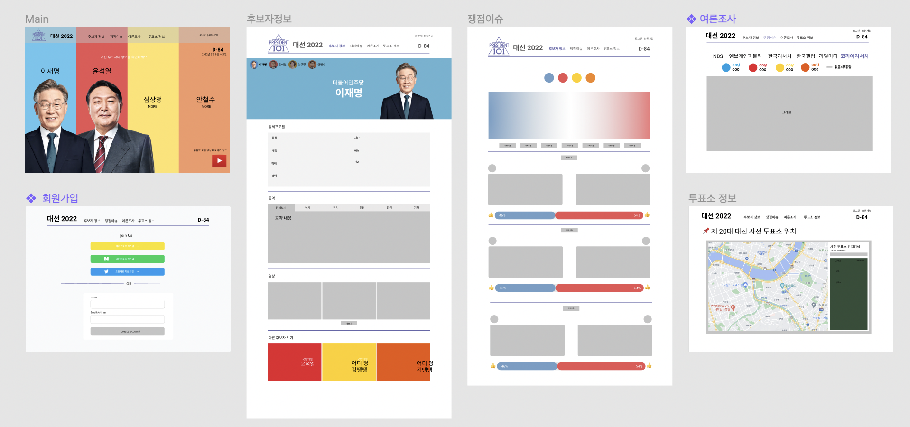

# (PRESIDENT 101)
- 당신의 대통령에게 투표하세요 ! 
- 2022년 대통령 선거정보 제공

## 프로젝트 구성 안내

* `bullet point 에 적힌 내용을 수정해 주시면 됩니다.`

* `초기 기획은 언제든 수정될 수 있으니 웹서비스 결과를 내는데 초점을 두시기 바랍니다.`

## 1. 프로젝트 소개

**어떠한 데이터셋와 도구 및 기술을 사용했는지에 대한 설명과 엔드유저에게 보이는 웹서비스에 대한 소개**

  - 기술 스택 : Vanilla JS, Node.js, MongoDB
  - 개요 : 2022년 대선을 앞두고 있습니다. 이에 대한 정보를 한눈에 보기 쉽게 제공하고자 기획하게 되었습니다.

## 2. 프로젝트 목표

  - 2022년 대선을 앞두고 있습니다. 이에 대한 정보를 한눈에 보기 쉽게 제공하고자 기획하게 되었습니다.

## 3. 프로젝트 기능 설명

**웹서비스의 유용성, 편의성 및 시각화의 실용성에 대한 설명**
  - 주요 기능 (주된 활용성) 및 서브 기능
  - 프로젝트만의 차별점, 기대 효과

## 4. 프로젝트 구성도
  - 와이어프레임/스토리보드 추가
  

## 5. 프로젝트 팀원 역할 분담
| 이름 | 담당 업무 |
| ------ | ------ |
| 손은정 | 팀장/프론트엔드 개발 |
| 이하현 | 프론트엔드 개발 |
| 조서영 | 프론트엔드 개발 |
| 이의섭 | 백엔드 개발 |
| 장서연 | 백엔드 개발 |

**멤버별 responsibility**

1. 프론트엔드 담당

- 기획 단계: 구체적인 설계와 지표에 따른 프로젝트 제안서 작성
- 개발 단계: 팀원간의 일정 등 조율 + 프론트 or 백엔드 개발
- 수정 단계: 기획, 스크럼 진행, 코치님 피드백 반영해서 수정, 발표 준비

2. 백엔드 담당

- 기획 단계: 큰 주제에서 문제 해결 아이디어 도출, 데이터 수집, 와이어프레임 작성
- 개발 단계: 와이어프레임을 기반으로 구현, 데이터 처리 및 시각화 담당, UI 디자인 완성
- 수정 단계: 피드백 반영해서 프론트 디자인 수정

## 6. 버전
  - 프로젝트의 버전 기입

## 7. FAQ
  - 자주 받는 질문 정리
